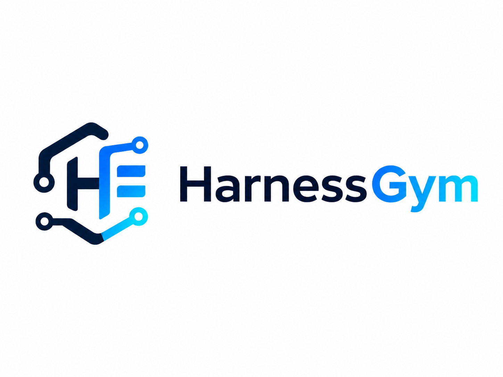

<p align="center" markdown>
  { width="520" }
</p>

# HarnessGym

**Run a coding agent on a hard task. Generate the reusable tooling it was
missing. Replay the next fresh session with that tooling activated.**

=== "PyPI"

    ```bash
    python -m pip install harnessgym
    ```

=== "From source"

    ```bash
    git clone https://github.com/patrick-toulme/harnessgym.git
    cd harnessgym
    python -m pip install -e ".[dev]"
    ```

=== "Verify"

    ```bash
    harnessgym --help
    ```

The core package has **zero third-party runtime dependencies** — it ships the
orchestrator, registry, qualification, activation, telemetry, and replay
machinery in pure Python stdlib. Runner backends shell out to whichever agent
CLI you choose (`codex` or `claude`); the deterministic `fake` runner needs no
account at all.

---

## What is HarnessGym?

`HarnessGym` is a framework for **iterative agent harness improvement**. The
idea is simple: a coding agent is only as good as the tools in its workspace,
so instead of asking it to re-derive the same instrumentation every session,
HarnessGym makes it *build that instrumentation once and carry it forward.*

Each iteration is a controlled five-phase loop:

- **Attempt.** A fresh runner session works the primary task — Codex, Claude
  Code, or the offline fake runner.
- **Reflect.** The *same* session names the single highest-leverage tool it was
  missing: a verifier, an analyzer, an MCP server, a benchmark helper, a
  fixture, or a skill.
- **Build.** That one artifact is created under `.harnessgym/`, with its own
  tests.
- **Qualify.** The artifact is activated in a clean copied workspace and
  self-tested. Anything that does not activate cleanly is quarantined and
  hidden from future attempts.
- **Replay.** The next fresh session starts with the promoted registry —
  generated skills symlinked in, generated MCP servers wired into the runner's
  config — and the accumulated tooling is active from the first token.

The source of truth stays repo-local under `.harnessgym/`. Each attempt starts
fresh, but the harness travels from iteration to iteration.

---

## One iteration, start to finish

Here is an optimization run on a CPU kernel task. HarnessGym runs Codex on the
benchmark, lets it build a harness, qualifies that harness, and replays:

```bash
harnessgym run \
  --task task.md \
  --workspace . \
  --iterations 5 \
  --attempt-timeout 5m \
  --runner exec \
  --optimization-mode \
  --score-key best_cycles \
  --stop-score 1 \
  --post-attempt-command "python3 benchmark.py --json --mode final" \
  --post-attempt-score-key best_cycles
```

Every attempt writes a machine-readable result that HarnessGym reads to decide
what happens next:

```json
{
  "status": "solved | blocked | incomplete | tooling_built | failed",
  "verified": true,
  "summary": "short description of what happened",
  "reflection": {
    "selected_improvement": {
      "kind": "skill | mcp | tool | verifier | fixture | docs | script | test",
      "name": "cpu-attention-autotune",
      "reason": "why this is the highest-leverage next addition",
      "target_path": ".harnessgym/mcp/cpu_attention_autotune/"
    }
  },
  "verification": {
    "status": "passed",
    "tooling_tests": [
      { "name": "mcp self-test", "status": "passed", "command": "python3 ..." }
    ]
  },
  "metrics": { "best_cycles": 130223, "score": 130223 }
}
```

`--optimization-mode` and `--post-attempt-command` mean HarnessGym **scores the
workspace itself** after every attempt — even an attempt that was killed by the
timeout before it could write its own result. The best independently-verified
checkpoint is preserved and restored at the end of the run.

[**How the loop works, phase by phase →**](how-it-works.md){ .md-button }

---

## Run it from any runner

The same loop drives three backends. Pick one with `--runner`:

=== "Codex (exec)"

    ```bash
    harnessgym run --task task.md --workspace . \
      --iterations 3 --runner exec
    ```

    Uses `codex exec` for attempts and `codex exec resume <session_id>` for the
    reflect/build phases. Generated MCP servers are launched through a
    telemetry proxy that preserves Content-Length framing.

=== "Claude Code"

    ```bash
    harnessgym run --task task.md --workspace . \
      --iterations 3 --runner claude --claude-model sonnet
    ```

    Uses `claude -p --output-format json` and `claude -p --resume`. Generated
    MCP servers are wired in through a repo-local MCP config and a stdio
    framing bridge.

=== "Fake (offline)"

    ```bash
    harnessgym run \
      --task examples/numerical_debug_task/task.md \
      --workspace examples/numerical_debug_task \
      --iterations 2 --attempt-timeout 10s --build-timeout 10s \
      --runner fake
    ```

    Deterministic, no model access, no network. The quickest way to watch the
    full attempt → reflect → build → replay loop end to end.

The orchestrator does not care which runner produced the work. Attempt,
reflect, build, qualify, activate, replay — the same machinery runs for all of
them.

[**Compare runners →**](runners/index.md){ .md-button }

---

## Results

These are real validation runs preserved in the repository. They are useful
engineering evidence — end-to-end proof that a generated, qualified, activated
harness changes what a fresh session reaches — not statistically powered
benchmark claims.

| Task | Harness artifact | Observed result |
| --- | --- | --- |
| **Tensor layout pipeline** | Skill + focused-search MCP | final score **33,975,173 → 1,495,982** cycles (**95.6%** lower) |
| **CPU attention autotune** | Config validation, scoring, search, rollback tools | harnessed replay **87.09%** lower held-out score, **~5×** less attempt time |
| **C flash attention** | 7-tool MCP with assembly + sweep + ranking | harnessed replay **169,005** vs plain **189,498** cycles, equal budget |
| **C++ stencil** | MCP grown 10 → 15 active tools | harnessed replay **34,934** vs plain **43,200** cycles |
| **H100 Triton RMSNorm** | Remote health checks, source sweeps, ranking | **150.0 µs → 103.3 µs**; follow-up expanded MCP to **17 active tools** |
| **Paged attention decode** | Skill + MCP search tools | harnessed `best_ms` **1.3588** vs plain **1.6759** |

[**Full numbers and methodology →**](results.md){ .md-button }

---

## Also: qualification and telemetry, not vibes

A generated tool that *looks* helpful but silently fails to activate is worse
than no tool. HarnessGym refuses to count one:

- **Fresh-workspace qualification.** After each build, the pre-run task
  workspace is copied, only the `.harnessgym/` bundle is copied in, generated
  skills/MCPs are activated there, and MCP self-tests run. Failures go back to
  the same session for up to `--artifact-repair-attempts` repair builds, then
  are **quarantined** — kept on disk for evidence, hidden from future attempts.
- **Real tool-call telemetry.** Every generated MCP `tools/call` is logged to
  `.harnessgym/mcp_calls.jsonl` with server name, tool name, argument-key
  summary, duration, status, and result size. Compare reports surface call
  counts and called tool names, so a harnessed win can require *actual* tool
  use, not mere activation.

[**Qualification →**](concepts/qualification.md){ .md-button }
[**Telemetry →**](concepts/telemetry.md){ .md-button }

---

## What HarnessGym is — and isn't

<span class="twemoji hg-yes">:material-check:</span> **Is:** a controlled loop
for generating, qualifying, and replaying reusable agent infrastructure —
skills and stdio MCP servers — and measuring whether they actually help.

<span class="twemoji hg-yes">:material-check:</span> **Is:** runner-agnostic.
Codex and Claude Code are first-class; a deterministic fake runner covers
tests and demos with no account.

<span class="twemoji hg-no">:material-close:</span> **Isn't:** an agent or a
model. HarnessGym never writes the kernel for you — it orchestrates the agent
you bring and keeps the tools it generates.

<span class="twemoji hg-no">:material-close:</span> **Isn't:** a benchmark
leaderboard. The bundled examples are evidence that the mechanism works, run on
one machine; repeat runs vary.

[**The philosophy behind the loop →**](philosophy.md){ .md-button }

---

## Start here

<div class="grid cards" markdown>

- :material-rocket-launch: **[Getting started](getting-started.md)** — mental model + the offline demo
- :material-cog-play: **[How it works](how-it-works.md)** — the five phases in detail
- :material-console: **[CLI reference](cli.md)** — every `run` and `compare` flag
- :material-shield-check: **[Qualification](concepts/qualification.md)** — why a broken harness can't win
- :material-chart-line: **[Results](results.md)** — H100, CPU kernel, and tensor-layout runs
- :material-flask: **[Experiments](experiments/index.md)** — preserved validation notes

</div>
